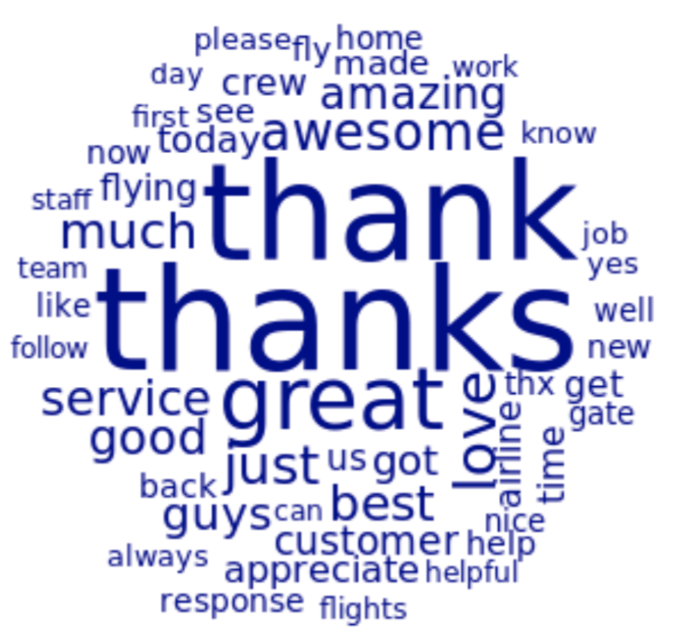
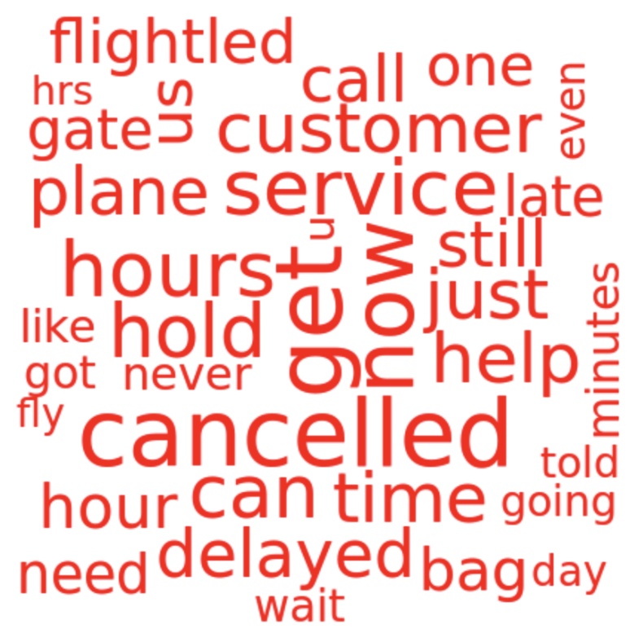
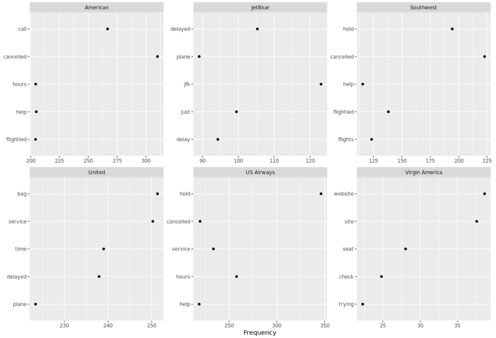
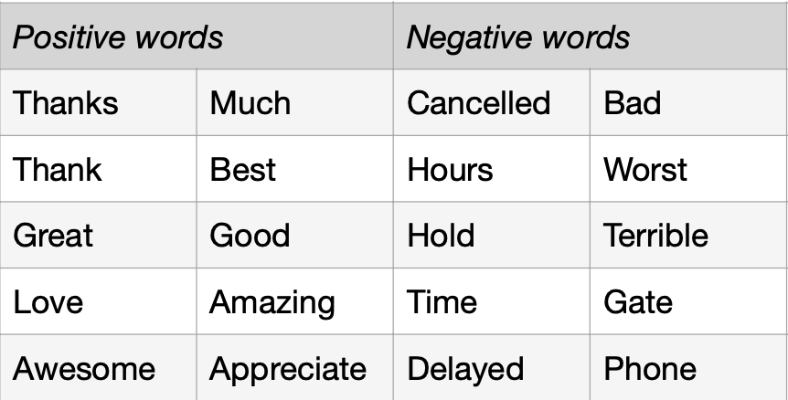
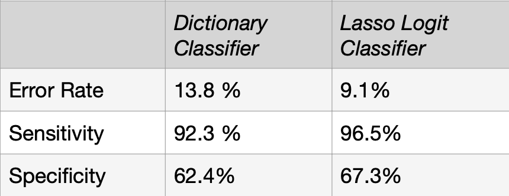

# Report on the Sentiment About Airlines Using Text Data Analysis on Tweets

## Introduction
This report analyzed more that 11,000 tweets to gauge customers’ sentiment towards the company and its major competitors. Word usage is compared between positive and negative tweets, and across airlines. Then, two predictive tools are built to classify them. A dictionary-based method and one using supervised machine-learning are compared to help the company respond better to customers in real time.

## Text preparation and word usage

Text preparation started with the removal of numbers, stopwords, punctuation, and symbols commonly used on Twitter. Very rarely used words were also removed to ease text data analysis. Term Frequency–Inverse Document Frequency (TF-IDF) weighting was carried out to help give an accurate picture of words that are most characteristic of tweets, and diminish the importance of uninformative words. TF-IDF weightings were carried out after the different groupings of documents as a TF-IDF weighted document-term matrix should not be amalgamated.

Some words are commonly associated with a positive or negative sentiment. Words of gratitude like “thanks” and “appreciate”, along with “awesome”, “great” and “amazing” are found in many positive tweets.

*Fig 1. Words most frequently used in positive tweets (TF-IDF weighted)*

On the other hand, the language associated to delay or cancellation (“hours”, “cancelled”, “hold”, “delayed”, “time”) are commonly associated with negative tweets.

*Fig 2. Words most frequently used in negative tweets (TF-IDF weighted)*

While commonly used words associated with a positive sentiment are similar across airlines, an overview of how negative word usage differs across airlines can help reveal specific customer complaints (Fig.3). For example, American Airlines, Southwest, and US Airways customers seemed to have troubles with cancelled flights and help service. JetBlue and United customers mostly complain about delays. Virgin America customers seem to dislike the website of the company. Many negative tweets associated to United mention “bag”, hinting at problems of luggage management by the company.

*Fig 3. Most frequently used words in negative tweets across airlines (TF-IDF weighted)*

## Dictionary-based classifier

A classic method to judge the sentiment of texts is to use a dictionary. For sentiment analysis, the dictionary includes language associated with positive and negative emotions. This list of pre- selected words can be used to classify tweets by analyzing the proportion of words associated with those emotions.
The customized dictionary includes fundamental words of sentiment analysis. It also includes jargon specific to airlines to fit the context in which the dictionary is used. The selection of words is based on the analysis of their frequency in tweets after they were grouped by sentiment and TF-IDF weighted.

*Table 1. Customized Dictionary*

## Lasso logit classifier

Lasso (Least Absolute Selection and Shrinkage Operator) is effective for feature selection by minimizing squared errors with a penalty for complexity. Cross-validation in a training set selected the optimal logit lasso model, which was then used to classify tweets in the test set. This classifier is based on a supervised machine- learning technique whereby the model ‘learns’ which words predicts the sentiment embedded in tweets.

## Comparing the classifiers’ performances

The accuracy of both classifiers can be tested comparing the type of sentiment they identified for each tweet against the previously hand- labelled sentiment category.

*Table 2. Comparison of the performance of both classifiers*

Both classifiers display outstanding sensitivity rates, indicating great efficacy at identifying tweets expressing a negative sentiment. Their lower specificity uncovers a weaker accuracy in identifying positive tweets for both classifiers. Remarkably, the classifier based on supervised machine-learning outperforms its dictionary- based counterpart with a lower error rate, and better sensitivity and specificity.

The poorer quality of the dictionary-based classifier can be explained by multiple factors. Dictionary-based methods are limited by the difficulty to turn word proportions into a single measure. Also, the threshold at which a text is classified as positive or negative is unclear and subject to subjectivity. Finally, the greatest limitation of this method is in the dictionary itself. Context-specific dictionaries are laborious to build and the 20 words of the dictionary used in this report cannot capture accurately the sentiment of a diversity of customers. On the other hand, supervised learning, i.e., classification with a regularized logit model is better equipped to handle vast size of text data and is more reliable, thanks to its optimal feature selection. In fact, this technique based on machine-learning can be thought of as an improvement of the dictionary method, where the computer would first ‘learn’ the dictionary.

## Conclusion

Despite its limitations, including the large cost and subjectivity of the necessary pre-labelling of many tweets to supervise the model, using the classifier based on the lasso logit method should be favoured by the company to classify future tweets.

